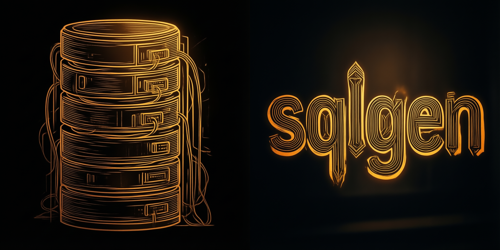

# sqlgen Documentation

Welcome to the sqlgen documentation. This guide provides detailed information about sqlgen's features and APIs.

## Core Concepts


  
  
  
  
  
  
  
  


## Database I/O


  
  


## Database Operations


  
  
  
  
  
  
  
  
  
  
  
  


## Other Operations


  
  
  
  
  
  
  


## Data Types and Validation


  
  
  
  
  
  
  


## Other concepts


  
  
  


## Supported Databases


  
  
  
  


For installation instructions, quick start guide, and usage examples, please refer to the [main README](../README.md).
